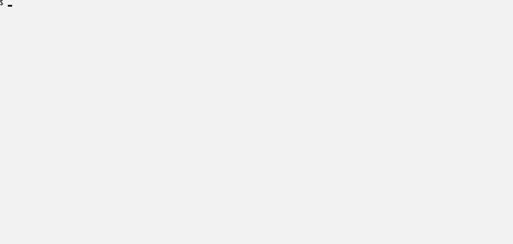

# bamazon-node-app

## Description

 A simple implementation of a storefront interface as a command line Node.js application. Utilizes the MySQL database.

## How to get started

Requires `Node.js` and access to a MyQSL server. Clone the repository to a local folder and install the dependencies with `npm install`. Use the provided files `bamazon-schema.sql` and `bamazon-data.sql` to create the structure of the `bamazon` database and populate it with initial data. Create a text file named `.env` in the app folder with the following contents, completed with the actual configuration of your MySQL server. 

```txt
# MySQL Connection Configuration
HOST=your-host
PORT=your-port
USER=your-username
PASSWORD=your-password
```

## 1. Customer View

This module allows the customer to browse inventory and place an order. Start the program with `node bamazonCustomer.js` and follow the on-screen instructions. An example of a typical session is shown below.


## 2. Manager View

This module allows the manager to browse and manage inventory. Start the program with `node bamazonManager.js` and follow the on-screen instructions. An example of a typical session is shown below.


## 3. Supervisor View

This module allows the supervisor to manage departments and view product sales by department. Start the program with `node bamazonSupervisor.js` and follow the on-screen instructions. An example of a typical session is shown below.


